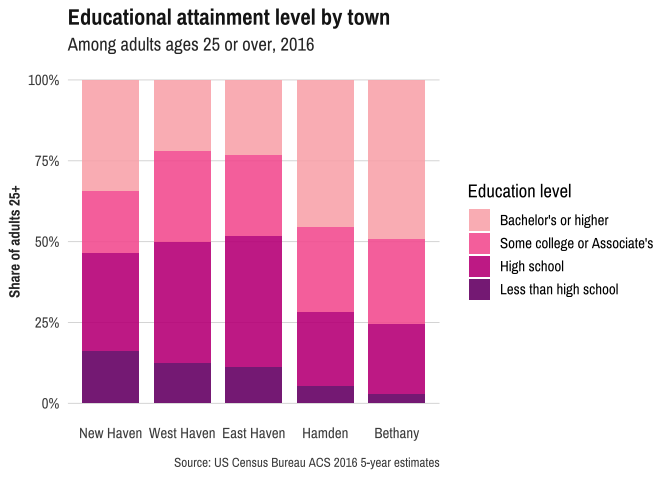

<!-- README.md is generated from README.Rmd. Please edit that file -->
camiller
========

[](https://travis-ci.org/camille-s/camiller)

`camiller` is a set of convenience functions, functions for working with ACS data via `tidycensus`, and a `ggplot` theme.

Installation
------------

Install from [GitHub](https://github.com/) with:

``` r
# install.packages("devtools")
devtools::install_github("camille-s/camiller")
```

Example
-------

This is a basic example of two of the major functions in this package, `add_grps` and `calc_shares`:

``` r
library(dplyr)
library(camiller)

edu_list <- list(ages25plus = 1, less_than_high_school = 2:16,
   high_school = 17:18, some_college_or_aa = 19:21, bachelors_plus = 22:25)

edu_rates <- edu_detail %>%
  dplyr::group_by(name) %>%
  add_grps(edu_list, group = variable, moe = moe) %>%
  calc_shares(group = variable, denom = "ages25plus", moe = moe)

edu_rates
#> # A tibble: 25 x 6
#> # Groups:   name [5]
#>    name       variable              estimate   moe  share sharemoe
#>    <chr>      <fct>                    <dbl> <dbl>  <dbl>    <dbl>
#>  1 Bethany    ages25plus                4013   148 NA       NA    
#>  2 Bethany    less_than_high_school      120    83  0.03     0.021
#>  3 Bethany    high_school                866   177  0.216    0.043
#>  4 Bethany    some_college_or_aa        1053   208  0.262    0.051
#>  5 Bethany    bachelors_plus            1974   257  0.492    0.061
#>  6 East Haven ages25plus               21230   490 NA       NA    
#>  7 East Haven less_than_high_school     2380   363  0.112    0.017
#>  8 East Haven high_school               8612   554  0.406    0.024
#>  9 East Haven some_college_or_aa        5334   511  0.251    0.023
#> 10 East Haven bachelors_plus            4904   468  0.231    0.021
#> # ... with 15 more rows
```

Plus this `ggplot` theme.

``` r
library(ggplot2)
library(forcats)
library(showtext)

font_add_google("Archivo Narrow", "archivo")
showtext_auto()

edu_rates %>%
  ungroup() %>%
  filter(!is.na(share)) %>%
  arrange(variable, share) %>%
  mutate(name = as.factor(name) %>% fct_inorder() %>% fct_rev()) %>%
  mutate(variable = fct_relabel(variable, function(x) {
    stringr::str_replace_all(x, "_", " ") %>% cap_first()
    })) %>%
  mutate(variable = fct_recode(variable, "Bachelor's or higher" = "Bachelors plus", 
                               "Some college or Associate's" = "Some college or aa")) %>%
  mutate(variable = fct_rev(variable)) %>%
  ggplot(aes(x = name, y = share, fill = variable)) +
    geom_col(position = "fill", width = 0.8, alpha = 0.9) +
    scale_y_continuous(labels = scales::percent) +
    scale_fill_manual(values = c("#FBB4B9", "#F768A1", "#C51B8A", "#7A0177")) +
    labs(x = NULL, y = "Share of adults 25+", fill = "Education level", 
         title = "Educational attainment level by town", 
         subtitle = "Among adults ages 25 or over, 2016", 
         caption = "Source: US Census Bureau ACS 2016 5-year estimates") +
    theme_din(base_family = "archivo")
```


